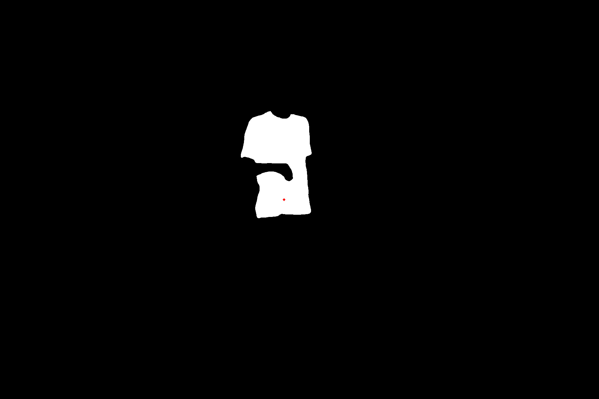
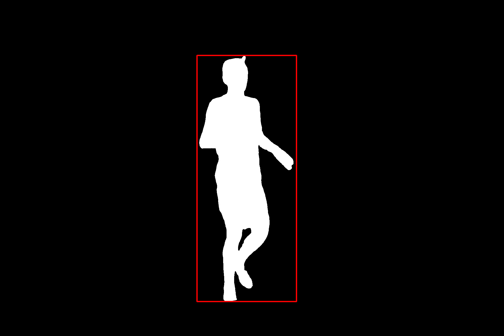
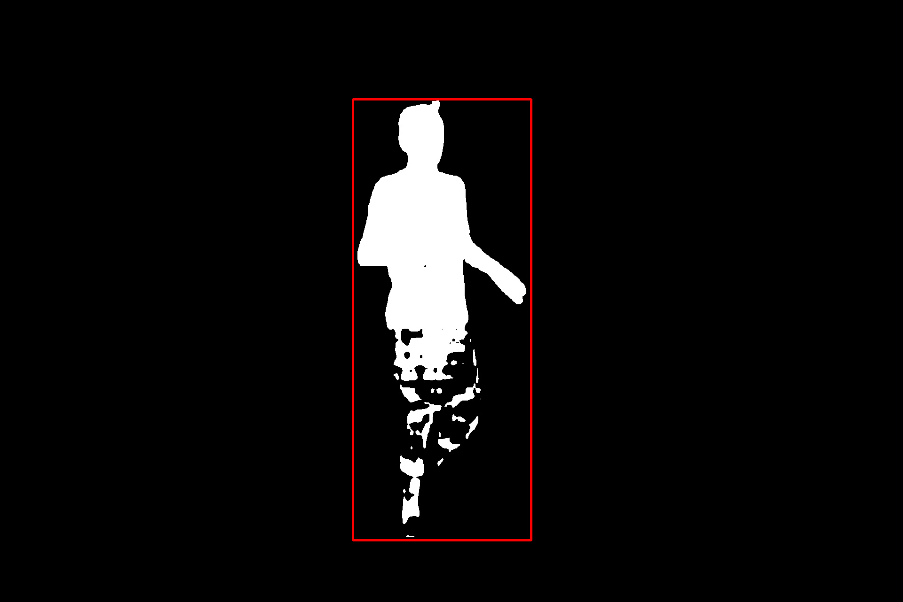

# Inpaint Anything

https://github.com/ZHEQIUSHUI/SAM-ONNX-AX650-CPP/assets/46700201/82b35088-7e9c-46b8-980f-bc9a3bc9996c

## Usage


### Segment Anything
```
/opt/test/sam # ./main -e ax_models/sam-encoder.axmodel -d ax_models/sam_vit_b_01ec64_decoder.onnx -i test.jpg
Engine creating handle is done.
Engine creating context is done.
Engine get io info is done.
Engine alloc io is done.
[I][                            init][ 233]: BGR MODEL
Encoder Inference Cost time : 0.737574s
Decoder Inference Cost time : 0.448962s
0.96
0.95
0.96
0.86
Decoder Inference Cost time : 0.438249s
0.98
1.00
0.98
0.91
```





### Inpaint
```
/opt/test/sam # ./main_inpaint -m big-lama-regular.axmodel  -i test.jpg --mask result_1
.jpg
image 1920x1282
mask 1920x1282
Engine creating handle is done.
Engine creating context is done.
Engine get io info is done.
Engine alloc io is done.
[I][                            init][ 275]: RGB MODEL
Inpaint Inference Cost time : 0.582908s
```


## Reference
[segment-anything](https://github.com/facebookresearch/segment-anything)\
[MobileSAM](https://github.com/ChaoningZhang/MobileSAM)\
[lama](https://github.com/advimman/lama)\
[SegmentAnything-OnnxRunner](https://github.com/OroChippw/SegmentAnything-OnnxRunner)
